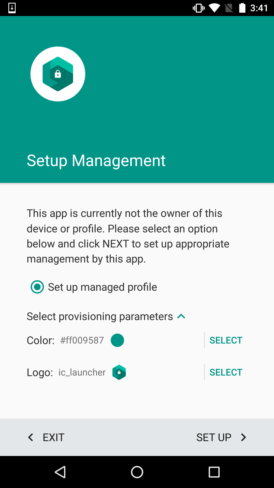
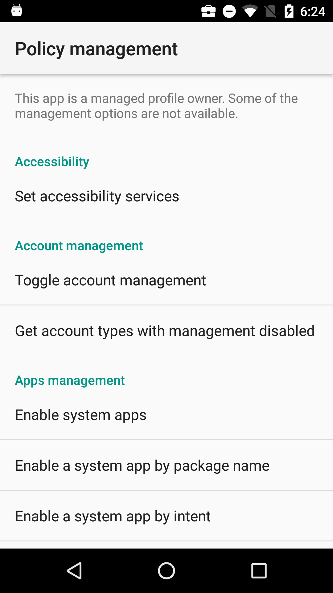
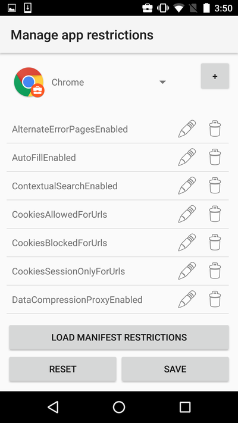
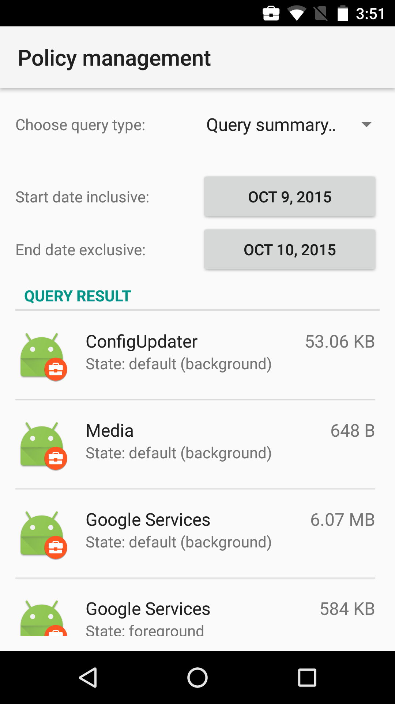

Test Device Policy Control (Test DPC) App
=========================================

Test DPC is an app designed to help EMMs, ISVs, and OEMs to test their applications and platforms in a Android for Work managed profile (i.e. work profile). It serves as both a sample Device Policy Controller and a testing application to flex the APIs available for Android for Work. It supports devices running Android 5.0 Lollipop or later. As of June 8, 2016, it also includes support for devices running API level 24.

See the [documentation](https://developer.android.com/work/index.html) to learn more about Android for Work.

Pre-requisites
--------------

- Android N SDK
- Android Build Tools v24.0.0
- Android Support Repository

Getting Started
---------------

This sample uses the Gradle build system. To build this project, use the "gradlew assemble" command or use "Import Project" in Android Studio.

NFC Provisioning
------------

The [NFC Provisioning app](https://github.com/googlesamples/android-NfcProvisioning) is used for *device owner* provisioning.

1. Push the nfcprovisioning.txt file to your device:
`adb push nfcprovisioning.txt /sdcard/`
2. Open the NFC Provisioning app and ensure that com.afwsamples.testdpc is auto-populated.
3. Bump the devices and touch to beam.
4. Follow onscreen instructions on the target device.

Screenshots
------------

Support
-------

If you've found an error in this sample, please file an issue:
https://github.com/googlesamples/android-testdpc/issues

Patches are encouraged, and may be submitted by forking this project and submitting a pull request through GitHub.

License
-------

Licensed under the Apache 2.0 license. See the LICENSE file for details.

How to make contributions?
--------------------------

Please read and follow the steps in the CONTRIB file.
